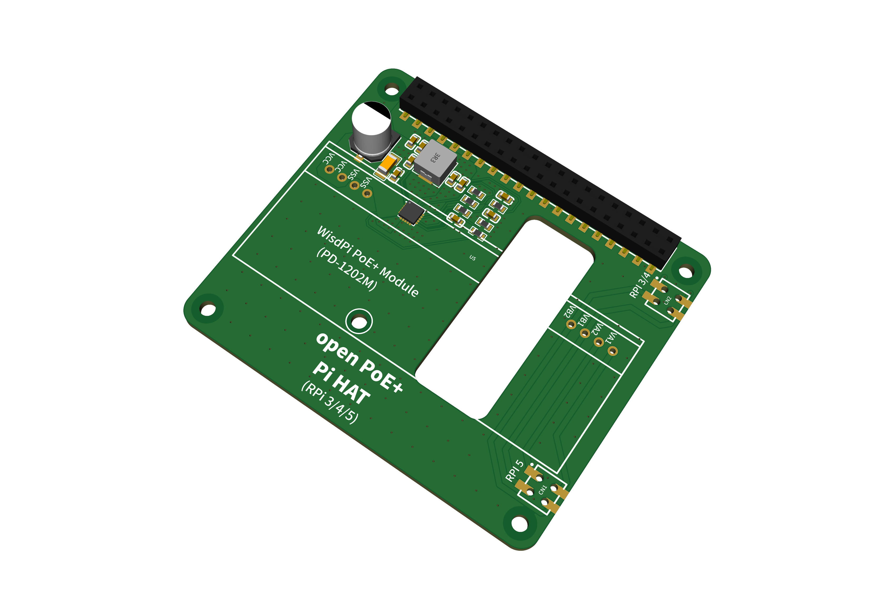
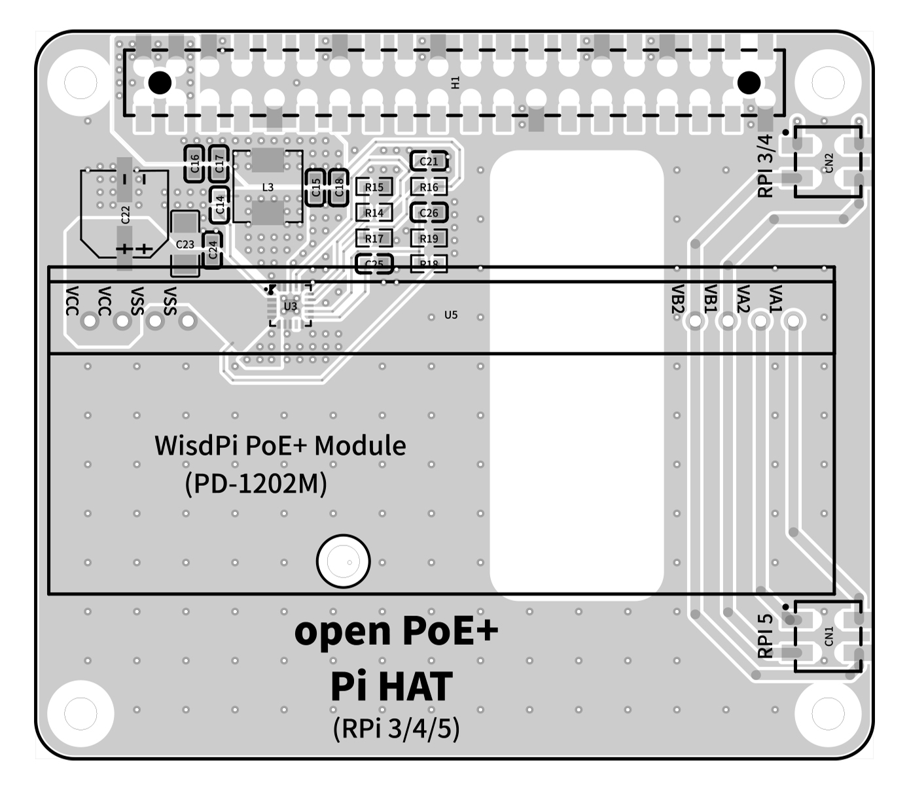
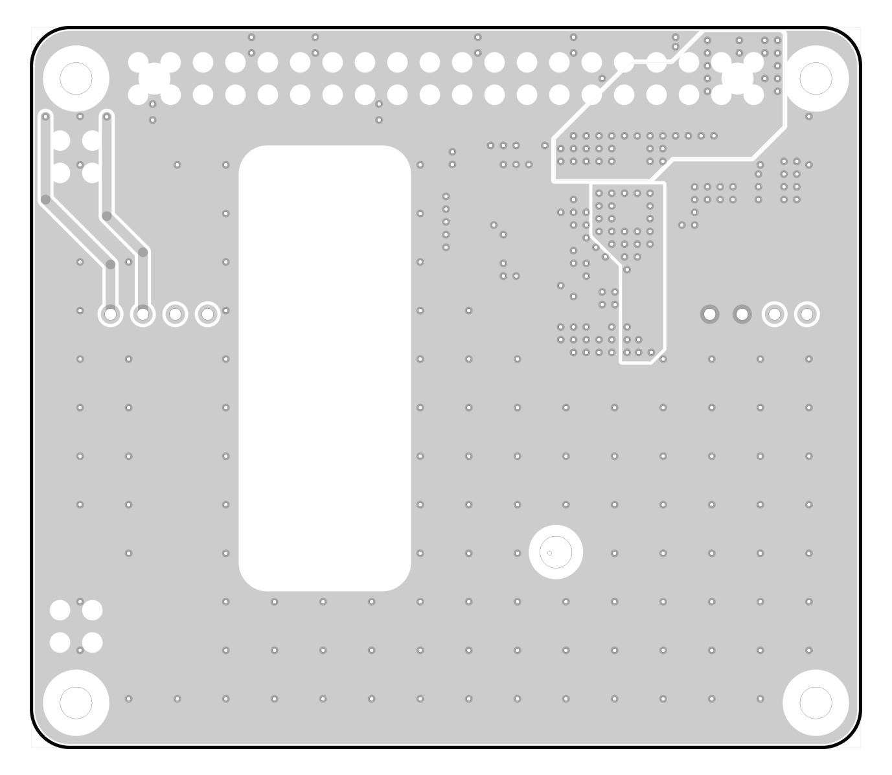

# open PoE Pi HAT

open source Raspberry Pi PoE+ HAT. 802.3at 30W standard.

+5.1V / Maximum current 4.5A to Pi with 40-Pin GPIO

Designed for Pi5, and also compatible with Raspberry Pi 3B+/4B.

Based on WisdPi PoE+ Module (PD-1202M)

The Open PoE Pi HAT is based on the WisdPi PoE+ Module(PD-1202M), which separates a 12V/2A power supply and uses Ti's DC-DC solution (TPS51396ARJER) to step down to a 5V power supply. It has been tested to provide a maximum current of 4.5A, which basically meets the power supply requirements of Raspberry Pi 5.

By using PC104 pin headers to connect to the Raspberry Pi, it provides two PoE interfaces, making it compatible with various sizes of Raspberry Pi 3B/4B/5 simultaneously.

The TPS51396ARJER is a highly efficient IC. When operating at full load, this board generates very little heat.

## OSHWA

OSHWA UID: CN000014

## SCH

## PCB

